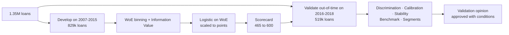
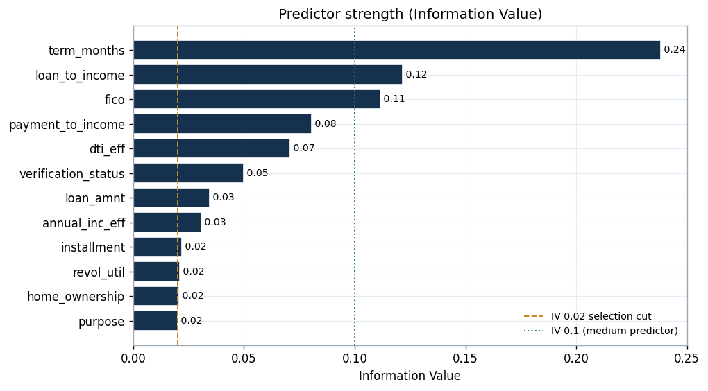
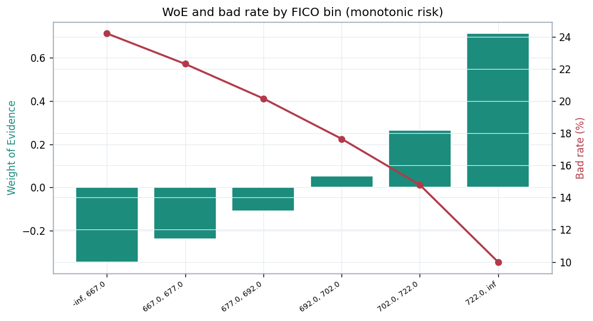
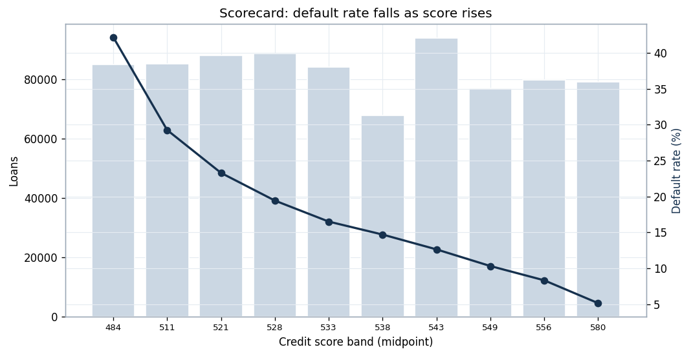
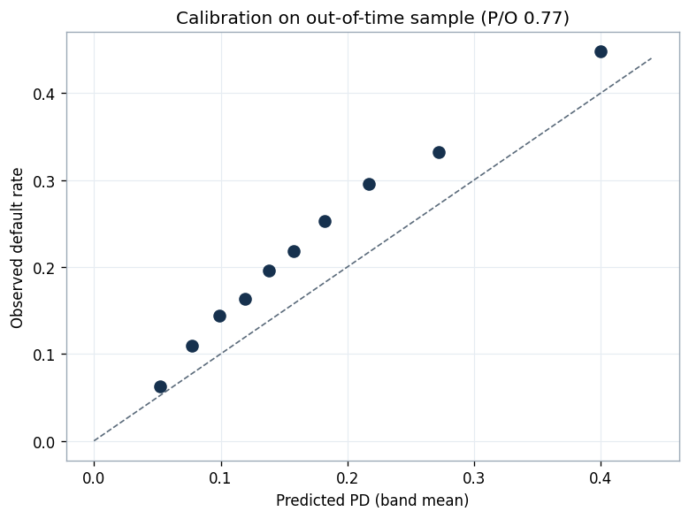
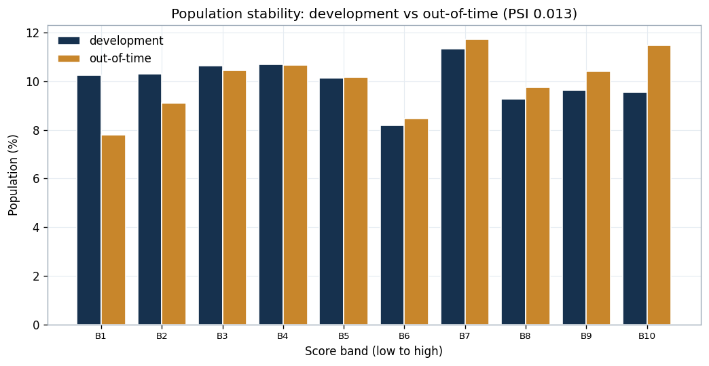
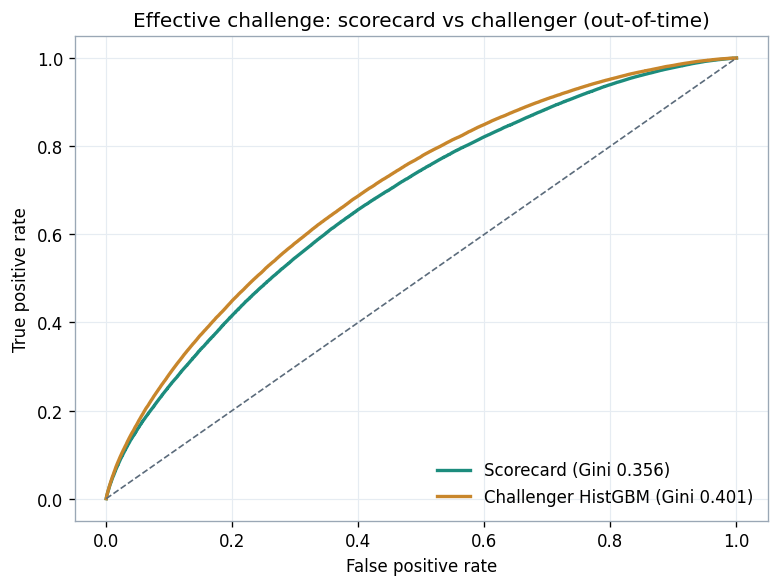
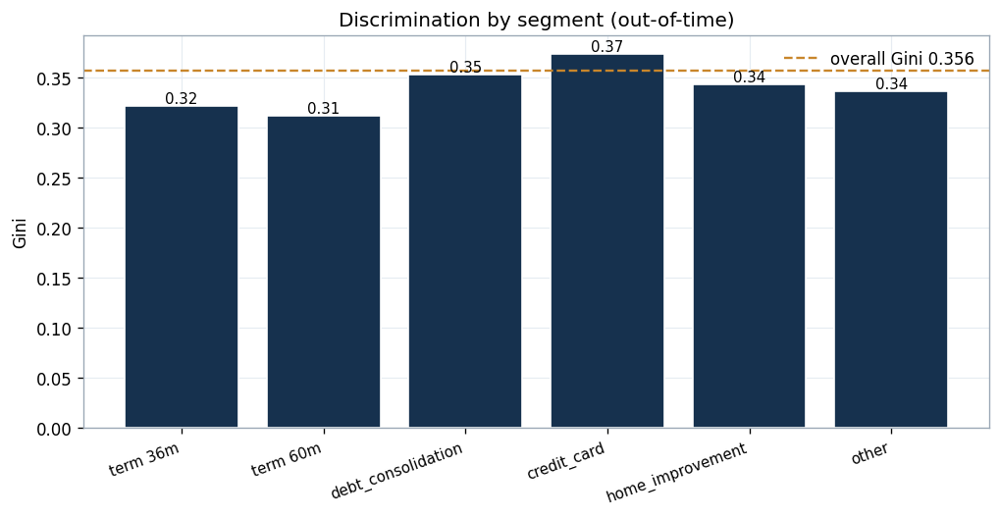

# PD Scorecard and Independent Model Validation

**A credit-scoring scorecard built the way banks build them, and then independently validated the way a second line of defence challenges a first-line model.**

This project has two halves. First it develops a probability-of-default application scorecard on 1.35 million real loans using the standard industry method: Weight of Evidence, Information Value, a logistic fit, and a points-based score. Then it puts on the independent-validation hat and challenges that scorecard across the five areas a model risk function cares about: discrimination, calibration, stability, benchmarking, and segment performance. The full write-up is in [`VALIDATION_REPORT.md`](VALIDATION_REPORT.md).

The validation is the point. It produces a real, material finding rather than a clean bill of health, which is exactly what effective challenge is for.

---

## Headline: the validation opinion

**Approved with conditions.** The scorecard discriminates well and stably, but it under-predicts the level of default on recent vintages and needs recalibration before any use that relies on the PD level.

| Validation area | Metric | Result | Standard | Rating |
|---|---|---|---|---|
| Discrimination | Gini, out-of-time | 0.356 | above 0.30 | GREEN |
| Calibration | predicted / observed PD | 0.77 | 0.90 to 1.10 | RED |
| Stability | PSI, development vs recent | 0.013 | below 0.10 | GREEN |
| Effective challenge | Gini gap to challenger | +0.045 | below 0.05 | GREEN |
| Segment performance | Gini across segments | 0.31 to 0.37 | within tolerance | GREEN |

Fit for ranking and approval decisions; not yet fit for risk-based pricing or IFRS 9 ECL until the central tendency is recalibrated.

---

## The scorecard



Each characteristic is binned and converted to a Weight of Evidence, predictors are selected by Information Value, a logistic regression is fitted on the WoE values, and the result is scaled to points (20 points to double the odds, anchored at 600 for odds of 50 to 1). Twelve characteristics were retained (IV at or above 0.02), led by loan term (0.238), loan-to-income (0.122) and FICO (0.112). The platform's own grade and interest rate were excluded so the model earns its signal independently.

---

## The validation

Five tests, on an out-of-time sample the model was never trained on:

- **Discrimination (GREEN).** Out-of-time Gini 0.356 and KS 0.256, down only slightly from development (Gini 0.385). Default rate falls cleanly from about 42% in the lowest band to 5% in the highest.
- **Calibration (RED, the material finding).** The predicted-to-observed PD ratio is 0.77, and every band sits above the diagonal on the calibration plot. The model was built on older, lower-default vintages, so its central tendency is anchored too low for the recent book. This must be recalibrated before any PD-level use.
- **Stability (GREEN).** PSI of 0.013 between development and recent vintages. Worth pairing with the calibration finding: the population is stable, but the default rate per score has risen, so stability of the population does not imply calibration of the PD.
- **Effective challenge (GREEN, watch).** A gradient-boosting challenger reaches Gini 0.401 versus the scorecard's 0.356, a gap of 0.045 that sits just inside tolerance. The scorecard's transparency justifies keeping it, with the small gap flagged for the next redevelopment.
- **Segment performance (GREEN).** Gini holds between 0.31 and 0.37 across both terms and the main loan purposes.

---

## Figures, with interpretation

**Predictor strength.** 
Information Value by characteristic, with the selection cut and the medium-predictor line marked.

**A clean characteristic.** 
Weight of Evidence rises monotonically with FICO while the bad rate falls from about 24% to 10%, the pattern a validator wants to see.

**The score works.** 
Default rate falls smoothly from about 42% to 5% across the score bands. Strong, monotonic rank-ordering.

**The material finding.** 
Every band lies above the diagonal: observed default exceeds predicted PD everywhere. This is the under-prediction the validation flags.

**Population stability.** 
Development and out-of-time score distributions overlay closely (PSI 0.013). The population is stable even though the central default rate has drifted.

**Effective challenge.** 
The scorecard against a gradient-boosting challenger out of time. The challenger is modestly ahead, not decisively so.

**Across segments.** 
Discrimination is consistent by term and purpose, all close to the overall Gini.

---

## Why it is built this way

A second line does not rebuild the business's models for them; it challenges them. So this project deliberately does the standard scorecard build, then tests it the way a validator would and reaches a conditional opinion with findings and recommendations, captured in a RAG-rated report. The most useful output is not a high score but the calibration finding, because surfacing that before a model is used for pricing or impairment is exactly what model oversight is for.

---

## Run it

```bash
pip install -r requirements.txt
python analysis.py        # builds the scorecard, runs the validation, writes figures and results.json
```

## Repository structure

```
.
├── analysis.py                 # scorecard development + full validation
├── pd_scorecard_validation.ipynb   # the same pipeline as an executed notebook
├── VALIDATION_REPORT.md        # the formal independent validation report (read this)
├── results.json                # all metrics
├── figures/                    # seven charts
├── data/
│   ├── scorecard_table.csv     # the points scorecard (characteristic, bin, WoE, points)
│   └── scored_dev_sample.csv   # sample of scored accounts
├── requirements.txt
├── LICENSE
└── README.md
```

## Data

The underlying **Lending Club** loan data is publicly available and used here for a non-commercial portfolio project. The **code** is released under the MIT License (see `LICENSE`).
